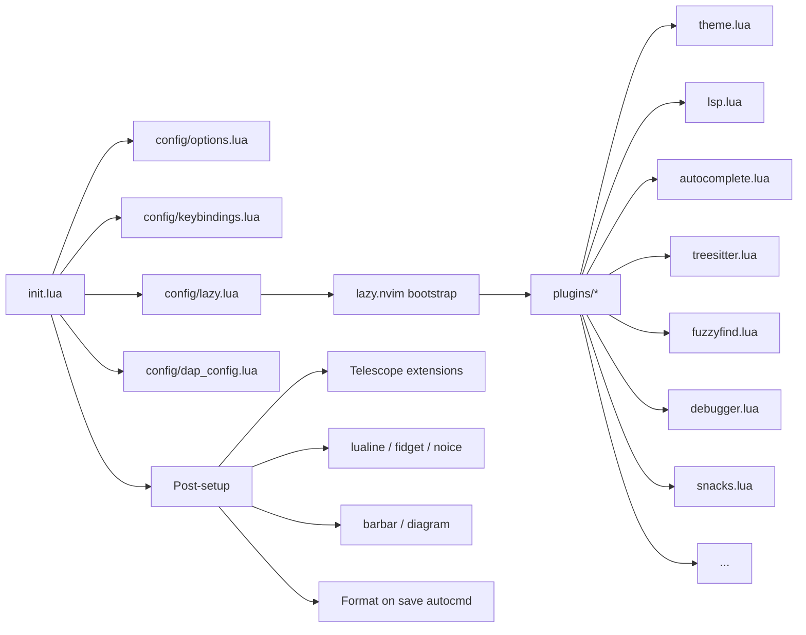
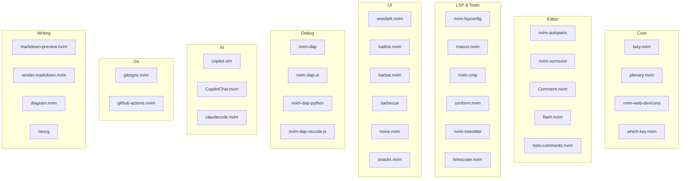

<h1 align="center">gxdot-neovim</h1>

<p align="center">
  <b>A modern, feature-rich Neovim configuration for productive development</b>
</p>

<p align="center">
  
  
  
  
  
</p>

---

## Highlights

- **Native LSP (Neovim 0.11+)** — Uses `vim.lsp.config()` and `vim.lsp.enable()` for first-class language support with pyright, ts_ls, and marksman
- **Multi-language DAP** — Full debugging for Python (pytest + uv), JavaScript/TypeScript (vscode-js-debug), and C++ (cppdbg) with DAP UI
- **AI-Powered Editing** — GitHub Copilot + CopilotChat for inline suggestions, and Claude Code for agentic coding assistance
- **Snacks Suite** — Dashboard, explorer, lazygit, notifier, picker, scroll, indent guides, and more from a single plugin
- **Telescope Ecosystem** — Fuzzy finder with fzf-native, DAP integration, symbols, and full keybinding coverage
- **Format on Save** — Conform.nvim auto-formats with prettier, stylua, ruff, and markdownlint on every write
- **Rich Markdown** — Live preview, rendered markdown in-buffer, and diagram rendering (mermaid, plantuml, d2, gnuplot)
- **One Dark Theme** — Consistent darker variant with barbecue breadcrumbs, lualine statusline, and barbar tabs

<!-- screenshot -->

## Quick Start

```bash
# 1. Backup existing config
mv ~/.config/nvim ~/.config/nvim.bak

# 2. Clone this repository
git clone https://github.com/yourusername/gxdot-neovim.git ~/.config/nvim

# 3. Open Neovim — lazy.nvim will auto-install all plugins
nvim
```

## Architecture



## File Structure

```
~/.config/nvim/
├── init.lua                     # Entry point: loads config, plugins, post-setup
├── lazy-lock.json               # Plugin version lockfile
├── lua/
│   ├── config/
│   │   ├── options.lua          # Core Neovim options (numbers, indent, search, UI)
│   │   ├── keybindings.lua      # All keybindings in one place
│   │   ├── lazy.lua             # lazy.nvim bootstrap and plugin loader
│   │   └── dap_config.lua       # DAP adapters and debug configurations
│   └── plugins/
│       ├── theme.lua            # OneDark colorscheme
│       ├── basic.lua            # which-key, neorg, startuptime, devicons, barbecue
│       ├── lsp.lua              # LSP servers, Mason, DAP telescope extension
│       ├── autocomplete.lua     # nvim-cmp + LuaSnip
│       ├── treesitter.lua       # Treesitter parsers
│       ├── fuzzyfind.lua        # Telescope + fzf-native
│       ├── formatter.lua        # Conform.nvim formatters
│       ├── linter.lua           # none-ls + nvim-lint
│       ├── debugger.lua         # DAP, DAP UI, DAP virtual text, DAP Python/JS
│       ├── editing.lua          # autopairs, surround, Comment.nvim
│       ├── navigation.lua       # flash.nvim
│       ├── copilot.lua          # GitHub Copilot + CopilotChat
│       ├── claudecode.lua       # Claude Code integration
│       ├── snacks.lua           # Snacks suite (dashboard, explorer, lazygit, etc.)
│       ├── tabs.lua             # barbar.nvim buffer tabs
│       ├── misc.lua             # toggleterm, todo-comments, fidget, lualine, noice, suda
│       ├── markdown.lua         # markdown-preview, render-markdown
│       ├── diagrams.lua         # diagram.nvim + image.nvim
│       ├── mcp.lua              # MCPHub for MCP server management
│       └── github-actions.lua   # GitHub Actions workflow viewer
```

## Plugin Map



## Plugins by Category

### Core

| Plugin | Purpose | Load |
|--------|---------|------|
| [lazy.nvim](https://github.com/folke/lazy.nvim) | Plugin manager | startup |
| [plenary.nvim](https://github.com/nvim-lua/plenary.nvim) | Lua utility library | dependency |
| [nvim-web-devicons](https://github.com/nvim-tree/nvim-web-devicons) | File type icons | lazy |
| [which-key.nvim](https://github.com/folke/which-key.nvim) | Keybinding hints popup | startup |
| [nui.nvim](https://github.com/MunifTanjim/nui.nvim) | UI component library | dependency |
| [nvim-nio](https://github.com/nvim-neotest/nvim-nio) | Async IO library | dependency |

### Theme & UI

| Plugin | Purpose | Load |
|--------|---------|------|
| [onedark.nvim](https://github.com/navarasu/onedark.nvim) | One Dark colorscheme (darker variant) | startup (priority 1000) |
| [lualine.nvim](https://github.com/nvim-lualine/lualine.nvim) | Statusline | startup |
| [barbar.nvim](https://github.com/romgrk/barbar.nvim) | Buffer tabline | startup |
| [barbecue](https://github.com/utilyre/barbecue.nvim) | VS Code-like winbar breadcrumbs | startup |
| [nvim-navic](https://github.com/SmiteshP/nvim-navic) | Code context for breadcrumbs | dependency |
| [noice.nvim](https://github.com/folke/noice.nvim) | UI for messages, cmdline, popupmenu | VeryLazy |
| [nvim-notify](https://github.com/rcarriga/nvim-notify) | Notification manager | dependency |
| [fidget.nvim](https://github.com/j-hui/fidget.nvim) | LSP progress indicator | startup |
| [snacks.nvim](https://github.com/folke/snacks.nvim) | Dashboard, explorer, lazygit, notifier, picker, scroll, indent, scope, and more | startup (priority 1000) |

### LSP

| Plugin | Purpose | Load |
|--------|---------|------|
| [nvim-lspconfig](https://github.com/neovim/nvim-lspconfig) | LSP server configurations | startup |
| [mason.nvim](https://github.com/williamboman/mason.nvim) | LSP/DAP/linter/formatter installer | dependency |
| [mason-lspconfig.nvim](https://github.com/williamboman/mason-lspconfig.nvim) | Bridge Mason ↔ lspconfig | dependency |

### Autocompletion

| Plugin | Purpose | Load |
|--------|---------|------|
| [nvim-cmp](https://github.com/hrsh7th/nvim-cmp) | Completion engine | startup |
| [cmp-nvim-lsp](https://github.com/hrsh7th/cmp-nvim-lsp) | LSP source for nvim-cmp | dependency |
| [LuaSnip](https://github.com/L3MON4D3/LuaSnip) | Snippet engine | dependency |
| [cmp_luasnip](https://github.com/saadparwaiz1/cmp_luasnip) | LuaSnip source for nvim-cmp | dependency |

### Treesitter

| Plugin | Purpose | Load |
|--------|---------|------|
| [nvim-treesitter](https://github.com/nvim-treesitter/nvim-treesitter) | Syntax highlighting, code parsing | startup |

### Search & Navigation

| Plugin | Purpose | Load |
|--------|---------|------|
| [telescope.nvim](https://github.com/nvim-telescope/telescope.nvim) | Fuzzy finder | on cmd/keys |
| [telescope-fzf-native.nvim](https://github.com/nvim-telescope/telescope-fzf-native.nvim) | FZF sorter for Telescope | startup |
| [telescope-dap.nvim](https://github.com/nvim-telescope/telescope-dap.nvim) | DAP integration for Telescope | VeryLazy |
| [telescope-symbols.nvim](https://github.com/nvim-telescope/telescope-symbols.nvim) | Symbol picker for Telescope | VeryLazy |
| [flash.nvim](https://github.com/folke/flash.nvim) | Jump anywhere with search labels | VeryLazy |

### Formatting & Linting

| Plugin | Purpose | Load |
|--------|---------|------|
| [conform.nvim](https://github.com/stevearc/conform.nvim) | Formatter (prettier, stylua, ruff, markdownlint) | BufReadPre/BufNewFile |
| [none-ls.nvim](https://github.com/nvimtools/none-ls.nvim) | Diagnostics bridge (markdownlint-cli2) | optional |
| [nvim-lint](https://github.com/mfussenegger/nvim-lint) | Async linter (markdownlint-cli2) | optional |

### Debug (DAP)

| Plugin | Purpose | Load |
|--------|---------|------|
| [nvim-dap](https://github.com/mfussenegger/nvim-dap) | Debug Adapter Protocol client | VeryLazy |
| [nvim-dap-ui](https://github.com/rcarriga/nvim-dap-ui) | UI for nvim-dap | VeryLazy |
| [nvim-dap-virtual-text](https://github.com/theHamsta/nvim-dap-virtual-text) | Inline variable values while debugging | VeryLazy |
| [nvim-dap-python](https://github.com/mfussenegger/nvim-dap-python) | Python DAP adapter (uv + pytest) | dependency |
| [nvim-dap-vscode-js](https://github.com/mxsdev/nvim-dap-vscode-js) | JS/TS DAP adapter (vscode-js-debug) | dependency |
| [vscode-js-debug](https://github.com/microsoft/vscode-js-debug) | VS Code JavaScript debugger | dependency |
| [mason-nvim-dap.nvim](https://github.com/jay-babu/mason-nvim-dap.nvim) | Auto-install DAP adapters via Mason | dependency |

### Editing

| Plugin | Purpose | Load |
|--------|---------|------|
| [nvim-autopairs](https://github.com/windwp/nvim-autopairs) | Auto-close brackets and quotes | InsertEnter |
| [nvim-surround](https://github.com/kylechui/nvim-surround) | Surround text (ys, ds, cs motions) | VeryLazy |
| [Comment.nvim](https://github.com/numToStr/Comment.nvim) | Toggle comments (gcc, gc{motion}) | startup |

### Git

| Plugin | Purpose | Load |
|--------|---------|------|
| [gitsigns.nvim](https://github.com/lewis6991/gitsigns.nvim) | Git signs in signcolumn, hunk actions | dependency |
| [github-actions.nvim](https://github.com/skanehira/github-actions.nvim) | View GitHub Actions workflows | startup |

### AI

| Plugin | Purpose | Load |
|--------|---------|------|
| [copilot.vim](https://github.com/github/copilot.vim) | GitHub Copilot inline suggestions | startup |
| [CopilotChat.nvim](https://github.com/CopilotC-Nvim/CopilotChat.nvim) | Chat with Copilot in a split | startup |
| [claudecode.nvim](https://github.com/coder/claudecode.nvim) | Claude Code integration (terminal + diff) | on keys |

### Terminal & Misc

| Plugin | Purpose | Load |
|--------|---------|------|
| [toggleterm.nvim](https://github.com/akinsho/toggleterm.nvim) | Terminal toggle | VeryLazy |
| [todo-comments.nvim](https://github.com/folke/todo-comments.nvim) | Highlight TODO/FIXME/HACK comments | startup |
| [vim-startuptime](https://github.com/dstein64/vim-startuptime) | Measure startup time | on cmd |
| [vim-suda](https://github.com/lambdalisue/vim-suda) | Read/write with sudo | startup |
| [mcphub.nvim](https://github.com/ravitemer/mcphub.nvim) | MCP server management | startup |
| [neorg](https://github.com/nvim-neorg/neorg) | Org-mode for Neovim | startup |

### Markdown & Diagrams

| Plugin | Purpose | Load |
|--------|---------|------|
| [markdown-preview.nvim](https://github.com/iamcco/markdown-preview.nvim) | Live markdown preview in browser | on cmd |
| [render-markdown.nvim](https://github.com/MeanderingProgrammer/render-markdown.nvim) | Render markdown in-buffer | on filetype |
| [diagram.nvim](https://github.com/3rd/diagram.nvim) | Render diagrams (mermaid, plantuml, d2, gnuplot) | VeryLazy |
| [image.nvim](https://github.com/3rd/image.nvim) | Image rendering in terminal | on filetype |

### Dependencies (internal)

| Plugin | Purpose |
|--------|---------|
| [hererocks](https://github.com/luarocks/hererocks) | Lua rocks installer |
| [lua-utils.nvim](https://github.com/nvim-neorg/lua-utils.nvim) | Lua utilities for neorg |
| [pathlib.nvim](https://github.com/pysan3/pathlib.nvim) | Path manipulation for neorg |

## Keybindings

**Leader key:** `<Space>`

### File Finding (Telescope)

| Keybinding | Mode | Action |
|------------|------|--------|
| `<leader><space>` | n | Smart Find Files |
| `<leader>,` | n | Buffers |
| `<leader>ff` | n | Find Files |
| `<leader>fg` | n | Find Git Files |
| `<leader>fr` | n | Recent Files |
| `<leader>fc` | n | Find Config File |
| `<leader>fb` | n | Buffers |
| `<leader>fp` | n | Projects |

### Search & Grep

| Keybinding | Mode | Action |
|------------|------|--------|
| `<leader>/` | n | Live Grep |
| `<leader>sg` | n | Grep |
| `<leader>sb` | n | Buffer Lines (fuzzy) |
| `<leader>sB` | n | Grep Open Buffers |
| `<leader>sw` | n, v | Grep Word / Visual Selection |
| `<leader>s"` | n | Registers |
| `<leader>s/` | n | Search History |
| `<leader>sa` | n | Autocmds |
| `<leader>sc` | n | Command History |
| `<leader>sC` | n | Commands |
| `<leader>sd` | n | Diagnostics |
| `<leader>sD` | n | Buffer Diagnostics |
| `<leader>sh` | n | Help Pages |
| `<leader>sH` | n | Highlights |
| `<leader>si` | n | Icons / Symbols |
| `<leader>sj` | n | Jumplist |
| `<leader>sk` | n | Keymaps |
| `<leader>sl` | n | Location List |
| `<leader>sm` | n | Marks |
| `<leader>sM` | n | Man Pages |
| `<leader>sp` | n | Plugin Specs |
| `<leader>sq` | n | Quickfix List |
| `<leader>sR` | n | Resume Last Search |
| `<leader>su` | n | Undo History |
| `<leader>:` | n | Command History |
| `<leader>n` | n | Notification History |

### LSP

| Keybinding | Mode | Action |
|------------|------|--------|
| `gd` | n | Goto Definition |
| `gD` | n | Goto Declaration |
| `gr` | n | References |
| `gI` | n | Goto Implementation |
| `gy` | n | Goto Type Definition |
| `<leader>ss` | n | Document Symbols |
| `<leader>sS` | n | Workspace Symbols |
| `<F4>` | n, i | LSP Format |

### Git

| Keybinding | Mode | Action |
|------------|------|--------|
| `<leader>gb` | n | Git Branches |
| `<leader>gl` | n | Git Log (commits) |
| `<leader>gL` | n | Git Log (buffer commits) |
| `<leader>gs` | n | Git Status |
| `<leader>gS` | n | Git Stash |
| `<leader>gd` | n | Git Diff (hunks) |
| `<leader>gf` | n | Git Log File |
| `<leader>gB` | n, v | Git Browse (open in browser) |
| `<leader>gg` | n | Lazygit |

### Debug (DAP)

| Keybinding | Mode | Action |
|------------|------|--------|
| `<F5>` | n, i | Continue |
| `<F6>` | n, i | Step Over |
| `<F7>` | n, i | Step Into |
| `<F8>` | n, i | Step Out |
| `<leader>dc` | n | Continue |
| `<leader>db` | n | Toggle Breakpoint |
| `<leader>dn` | n | Step Over |
| `<leader>di` | n | Step Into |
| `<leader>do` | n | Step Out |
| `<leader>ds` | n | Close/Stop |
| `<leader>dl` | n | Run Last |
| `<leader>dp` | n | Pause |
| `<leader>da` | n | Attach |
| `<leader>dt` | n | Toggle DAP UI |
| `<leader>Di` | n | Float Element |
| `<leader>De` | n | Evaluate Expression |
| `<leader>dw` | n, v | Add to Watches |
| `<leader>dpy` | n | Test Method (Python) |
| `<leader>dpc` | n | Test Class (Python) |
| `<leader>dps` | n | Debug Selection (Python) |

### Buffers (Barbar)

| Keybinding | Mode | Action |
|------------|------|--------|
| `<A-,>` | n | Previous Buffer |
| `<A-.>` | n | Next Buffer |
| `<A-<>` | n | Move Buffer Left |
| `<A->>` | n | Move Buffer Right |
| `<A-1>` … `<A-9>` | n | Go to Buffer 1–9 |
| `<A-0>` | n | Last Buffer |
| `<A-p>` | n | Pin/Unpin Buffer |
| `<A-c>` | n | Close Buffer |
| `<C-p>` | n | Pick Buffer |
| `<C-S-p>` | n | Pick Buffer to Delete |
| `<leader>bb` | n | Order by Buffer Number |
| `<leader>bn` | n | Order by Name |
| `<leader>bD` | n | Order by Directory |
| `<leader>bl` | n | Order by Language |
| `<leader>bw` | n | Order by Window Number |
| `<leader>bd` | n | Delete Buffer |

### Terminal

| Keybinding | Mode | Action |
|------------|------|--------|
| `<C-/>` | n, t | Toggle Terminal |
| `<C-_>` | n, t | Toggle Terminal (alt) |
| `<C-s>` | n | Open ToggleTerm |
| `<C-t>` | t | Exit Terminal Mode |
| `<leader>tt` | n | Terminal in New Tab |
| `<leader>tv` | n | Terminal in Vertical Split |
| `<leader>th` | n | Terminal in Horizontal Split |

### AI: Copilot

| Keybinding | Mode | Action |
|------------|------|--------|
| `<A-c>` | i | Accept Copilot Suggestion |
| `<A-d>` | i | Next Suggestion |
| `<A-a>` | i | Previous Suggestion |
| `<A-s>` | i | Open Copilot Panel |

### AI: Claude Code

| Keybinding | Mode | Action |
|------------|------|--------|
| `<leader>cc` | n | Toggle Claude Code |
| `<C-,>` | t | Toggle Claude Code (terminal) |
| `<leader>cC` | n | Claude Code: Continue |
| `<leader>cV` | n | Claude Code: Verbose |
| `<leader>cr` | n | Claude Code: Resume |
| `<leader>cf` | n | Focus Claude Code |
| `<leader>ca` | n | Accept Claude Diff |
| `<leader>cd` | n | Deny Claude Diff |
| `<leader>cs` | v | Send Selection to Claude |
| `<leader>cb` | n | Add Buffer to Claude |
| `<leader>cm` | n | Select Claude Model |
| `<leader>cs` | n (tree) | Add File from Tree to Claude |

### Snacks Features

| Keybinding | Mode | Action |
|------------|------|--------|
| `<leader>e` | n | Toggle Explorer |
| `<leader>Sn` | n | Notification History |
| `<leader>Sd` | n | Dismiss Notifications |
| `<leader>Se` | n | Toggle Explorer |
| `<leader>Ss` | n | Scratch Buffer |
| `<leader>SS` | n | Select Scratch Buffer |
| `<leader>Sg` | n | Lazygit |
| `<leader>Sl` | n | Git Log (Lazygit) |
| `<leader>Sf` | n | Git File Log |
| `<leader>Sb` | n | Git Blame Line |
| `<leader>St` | n | Terminal |
| `<leader>Sz` | n | Zen Mode |
| `<leader>SD` | n | Toggle Dim |
| `<leader>Sp` | n | Profiler |

### Toggles

| Keybinding | Mode | Action |
|------------|------|--------|
| `<leader>us` | n | Toggle Spelling |
| `<leader>uw` | n | Toggle Wrap |
| `<leader>uL` | n | Toggle Relative Number |
| `<leader>ud` | n | Toggle Diagnostics |
| `<leader>ul` | n | Toggle Line Number |
| `<leader>uc` | n | Toggle Conceallevel |
| `<leader>ub` | n | Toggle Dark Background |
| `<leader>uh` | n | Toggle Inlay Hints |
| `<leader>uT` | n | Toggle Treesitter Join |
| `<leader>uC` | n | Colorschemes |
| `<leader>un` | n | Dismiss All Notifications |
| `<leader>um` | n | Toggle Render Markdown |

### Flash Navigation

| Keybinding | Mode | Action |
|------------|------|--------|
| `s` | n, x, o | Flash Jump |
| `S` | n, x, o | Flash Treesitter |
| `r` | o | Remote Flash |
| `R` | o, x | Treesitter Search |

### Formatting & Editing

| Keybinding | Mode | Action |
|------------|------|--------|
| `<leader>F` | n | Format Buffer (async) |
| `<leader>C` | n, v | Format File or Range |
| `<leader>z` | n | Toggle Zen Mode |
| `<leader>Z` | n | Toggle Zoom (maximize window) |
| `<leader>Vc` | n | Reload Neovim Config |

### Markdown

| Keybinding | Mode | Action |
|------------|------|--------|
| `<leader>cp` | n | Toggle Markdown Preview (markdown ft only) |

### Tabs

| Keybinding | Mode | Action |
|------------|------|--------|
| `]]` | n, t | Next Tab |
| `[[` | n, t | Previous Tab |

### Misc

| Keybinding | Mode | Action |
|------------|------|--------|
| `<leader>N` | n | Neovim News |

## Core Options

### Numbers

| Option | Value | Description |
|--------|-------|-------------|
| `number` | `true` | Show absolute line numbers |
| `relativenumber` | `true` | Show relative line numbers |

### Indentation

| Option | Value | Description |
|--------|-------|-------------|
| `tabstop` | `4` | Tab width |
| `shiftwidth` | `4` | Indent width |
| `expandtab` | `true` | Spaces instead of tabs |
| `smartindent` | `true` | Auto-indent new lines |

### Search

| Option | Value | Description |
|--------|-------|-------------|
| `ignorecase` | `true` | Case-insensitive search |
| `smartcase` | `true` | Case-sensitive if uppercase present |
| `hlsearch` | `true` | Highlight search matches |
| `incsearch` | `true` | Incremental search |

### UI

| Option | Value | Description |
|--------|-------|-------------|
| `scrolloff` | `8` | Lines to keep above/below cursor |
| `sidescrolloff` | `8` | Columns to keep left/right of cursor |
| `signcolumn` | `yes` | Always show signcolumn |
| `termguicolors` | `true` | 24-bit color |
| `cursorline` | `true` | Highlight current line |
| `wrap` | `false` | No line wrapping |
| `colorcolumn` | `100` | Color column at position 100 |

### Behavior

| Option | Value | Description |
|--------|-------|-------------|
| `clipboard` | `unnamedplus` | System clipboard integration |
| `undofile` | `true` | Persistent undo |
| `swapfile` | `false` | No swap files |
| `backup` | `false` | No backup files |
| `splitright` | `true` | Vertical splits open right |
| `splitbelow` | `true` | Horizontal splits open below |
| `updatetime` | `250` | Faster CursorHold events (ms) |
| `timeoutlen` | `300` | Key sequence timeout (ms) |
| `mouse` | `a` | Mouse support in all modes |
| `fileencoding` | `utf-8` | UTF-8 encoding |
| `hidden` | `true` | Allow hidden buffers |

## LSP Servers & Formatters

### LSP Servers

| Server | Language | Auto-install |
|--------|----------|-------------|
| pyright | Python | Yes (Mason) |
| ts_ls | TypeScript / JavaScript | Yes (Mason) |
| marksman | Markdown | Yes (Mason) |

### Formatters (Conform.nvim)

| Filetype | Formatter(s) |
|----------|-------------|
| javascript, typescript, jsx, tsx | prettier |
| svelte, css, html, json, yaml, graphql | prettier |
| lua | stylua |
| python | ruff |
| markdown, mdx | prettier, markdownlint-cli2, markdown-toc |

### Linters

| Filetype | Linter |
|----------|--------|
| markdown | markdownlint-cli2 |

## DAP Configurations

<details>
<summary><b>Python</b></summary>

- **Runner:** pytest
- **Runtime:** uv
- **Configurations:**
  - `Launch (mediahub)` — Launch project main with custom args
  - `Launch current file` — Launch the active file
- **Python path resolution:** checks `./venv/bin/python`, `./.venv/bin/python`, falls back to `/usr/bin/python`

</details>

<details>
<summary><b>JavaScript / TypeScript</b></summary>

- **Adapter:** pwa-node (vscode-js-debug)
- **Configurations:**
  - `Launch Node.js` — Launch `server.js` with `.env` support
  - `Attach to Node.js process` — Attach to a running process
- **Supported adapters:** pwa-node, pwa-chrome, pwa-msedge, node-terminal, pwa-extensionHost

</details>

<details>
<summary><b>C++</b></summary>

- **Adapter:** cppdbg (auto-installed via Mason)
- Uses default Mason-DAP handler configuration

</details>

## Requirements

| Requirement | Purpose |
|-------------|---------|
| **Neovim 0.11+** | Native LSP API (`vim.lsp.config`, `vim.lsp.enable`) |
| **Git** | Plugin management, git integration |
| **Node.js** | Copilot, prettier, markdown-preview, vscode-js-debug |
| **Python 3** | pyright, dap-python, ruff |
| **ripgrep** (`rg`) | Telescope live grep |
| **fd** | Telescope file finder |
| **lazygit** | Snacks lazygit integration |
| **make** | Build telescope-fzf-native |
| **C compiler** | Treesitter parser compilation |
| A [Nerd Font](https://www.nerdfonts.com/) | Icons in UI (devicons, barbar, lualine) |

## Credits

- [folke](https://github.com/folke) — lazy.nvim, snacks.nvim, which-key, flash, todo-comments, noice
- [neovim/nvim-lspconfig](https://github.com/neovim/nvim-lspconfig) — LSP configurations
- [hrsh7th/nvim-cmp](https://github.com/hrsh7th/nvim-cmp) — Completion engine
- [mfussenegger/nvim-dap](https://github.com/mfussenegger/nvim-dap) — Debug Adapter Protocol
- [nvim-telescope](https://github.com/nvim-telescope) — Fuzzy finder ecosystem
- [coder/claudecode.nvim](https://github.com/coder/claudecode.nvim) — Claude Code integration
- [github/copilot.vim](https://github.com/github/copilot.vim) — GitHub Copilot
